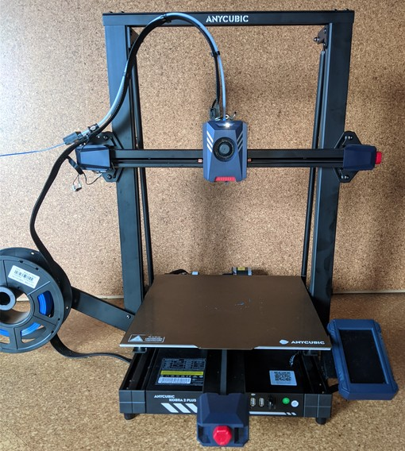

# Frame 

??? tip "Tram The Frame"  

    As already mentioned in the introduction of this hardware section, **I strongly recommend to check and tram the whole construction of the printer's frame first. Check the base frame as well as the z-axis frame even before mounting them together.**  

    *Check the whole frame if everything is square, rectangular and perpendicular, check all screws, bolts, belts, wheels, electrical connectors - literally everything.* This will save you a lot of hassle, frustration and headaches later..  

    *Seriously, I can't encourage you enough to do a complete check-up and maintenance of your printer before you even try to print the first time.*    
    Not only will you get to know your printer better, it'll most likely save you headaches and many hours of fiddling around trying to find the perfect print settings - just to despair of weird artifacts showing up on prints just when you thought you found the perfect settings because they were caused by a sticky and partially clogged lead screw thread or so.   

    Get yourself a good carpenter's square in a 90° rectangular angle. Make sure the tool itself actually really *is* square - especially the cheap ones being offered often lack of precision and aren't really square themself.  
    When attempting to measure the parts of the frame and bring them into the correct position, always measure at both sides of the construction. By doing so you can mostly avoid any misalignments which might occur if only checking at one side and maybe not really paying attention to the parts of the rails which are further away.  
    You can also strengthen the construction itself by adding certain coponents which make sure the construction is and stays in a rectangular position.  
    It's also advisable to use some screw glue like Loctite, just to make sure screws won't come loose over time due to the vibrations of the machine.  

    Take your time setting up the frame of the printer (and the axes and wheels etc. after doing so as well), be as precise as you can be. Every misalignment here will most likely cause some weird issues later which might be hard to find or even solve if you're not remembering that maybe the construction itself might be the cause.   

The machine comes preassembled with basically two major frame parts (which consist of individual parts) which I'd call the base frame and the z-axis frame.  
Unfortunately I don't have pictures of these individual frame parts, so I can't show them here, but it's what you take out of the package when you unbox the machine.  

<!--
The following picture shows what I'd call the base frame.  

   

On there you mount the z-axis frame which is shown in the following pictures (frontside view / backside view).  

   

   
-->

The z-axis frame is being mounted to the baseframe by using some brackets which has to be screwed to the side of the baseframe.  
When you're mounting the parts, *make sure the z-frame really is perpendicular to the baseframe*!  
*This is crucial as you don't want to have a tilted z-frame!* Use e.g. a carpenter's square to check everything.  
Be as precise as you can be as it'll save you a lot of headaches and issues in the future when using the machine!  

The folowing picture shows one of those mounting brackets from the front view.  

  

You then also have to mount two stabilizer rods from the top of the z-frame to the back of the baseframe, one to each side. Preferrably these ones should *not* be used to somewhat straighten out a tilted z-frame, they should only reinforce the whole construction - but if it's impossible to mopunt the frame perpendicular without enforcing it's position using these rods, then you have to do it that way.  
The following picture shows one of these stabilizer rods.  

  

The following pictures show the belonging mounting points.  

| Mounting point bottom | Mounting point top |  
|:---------------------:|:------------------:|
|  |  |

So, again: make sure the z-frame is mounted *perpendicular* to the baseframe, then add the stabilizer rods. Once everything is assembled, use the carpenter's square again to check if everything is properly aligned.  

The following picture shows the mounting bracket of the z-axis and the mounting point for the stabilizer rods at the baseframe from an underside point of view at one side of the printer.  

  

    
After mounting both parts together, you'll already have the printer standing in front of you.  

| Kobra 2 Plus frontview | Kobra 2 Plus backview |  
|:---------------------:|:--------------------:| 
|  |   | 

The following picture shows the printer from the sideview, so you can see the stabilizer rods better.  

    

---

  
