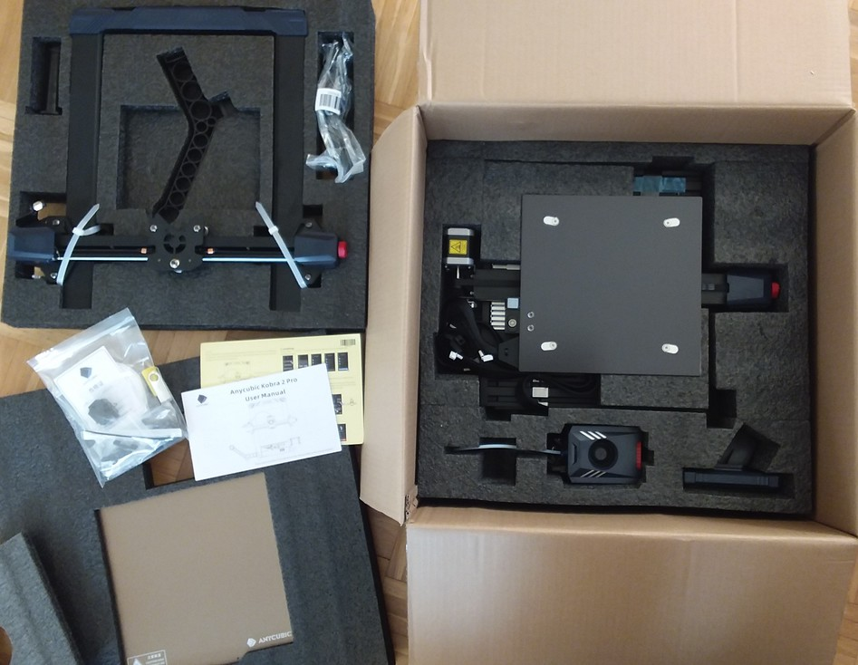
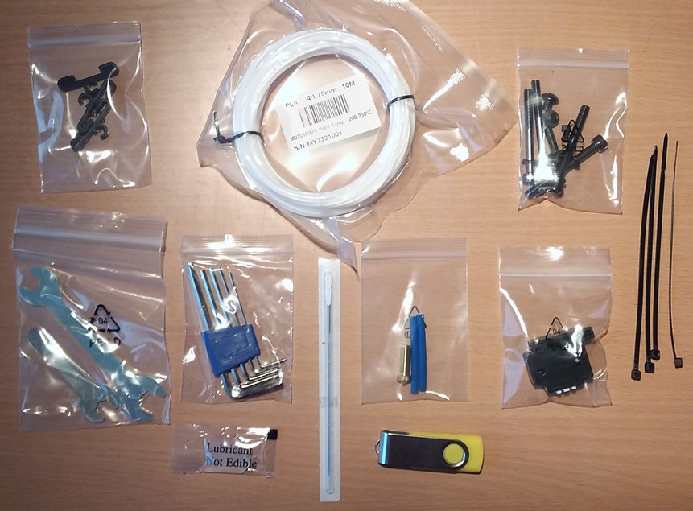

<link rel=”manifest” href=”docs/manifest.webmanifest”>

# Printer
The Anycubic [**Kobra 2 Max**](https://www.anycubic.com/products/kobra-2-max) is a high speed FDM bedslinger style printer.  
It comes pre-assembled, you only have to mount a few parts like the 'upstanding' frame onto the base frame.  

See [Anycubic's support page](https://www.anycubic.com/pages/firmware-software) of the Kobra 2 series to find manuals, firmware, video tutorials and more or use the direct links in the following.  

- [Quick Start Guide v1.0](https://drive.google.com/file/d/1xiUJX_E-CbsSBF-p_6eHCVAp4zDlSfP5/view)
- [User manual v1.1](https://drive.google.com/file/d/1HwjqHPOJWJgbi4tADEKev3eCk3uroeOg/view)

The following pictures show the machine.  
  
| Kobra 2 Max frontview | Kobra 2 Max backview |  
|:---------------------:|:--------------------:| 
|  |   |  

The following picture shows the printer from the sideview, so you can see the stabilizer rods better.  

  

--- 

## Specifications  
  
The following list gives an overview of the most important specifications:    

- Printing dimension: 500 x 420 x 420 mm / 19.7 x 16.5 x 16.5 inches (HxWxD) 
- Printing platform: 420 x 420mm / 16.5 x 16.5 inches (*Attention: the physical dimensions of the bed and the PEI plate are 430x430mm!*) 
- Machine dimensions: 740 x 735 x 640 mm / 29.1 x 28.9 x 25.1 inches (HxWxD) (plus filament holder mounted to the left side of the base frame) 
- Machine weight: approx. 21 kg
- Printing volume: 88.2 l / 23.2 gal
- Aluminum frame  
- X-axis and Y-axis: belt driven (belt tension can be adjusted by knobs), "dual-shaft core" with SG15 bearings/metal rollers (no POM wheels)   
- Z-axis: double threaded rod, two motors  
- Printing speed: 500 mm/s (maximum speed), 300mm/s (typical/average speed)
- Control panel: 4.3" LCD touchscreen  
- Mainboard: TriGorilla Spe V1.0.0, 1.2GHz Cortex-A7, 32bit, 24V, TMC2209 silent stepper drivers (soldered), WiFi, 3x USB-A connectors 
- Extruder / feeder system: direct drive, double gears  
- Heated aluminum bed with a magnetic foil on the top surface and an insulation at the underside glued onto it, comes with a removable, single side PEI-coated spring steel plate; *physical dimensions: 430x430mm*  
- Hot bed temperature: 90 °C / ≤ 190 °F  
- Automatic leveling: "Anycubic LeviQ2.0" (which is a 49-point bed level measuring process) and "smart Z-offset" 
- Power supply: 400W, 24V DC output, suitable for 110V/230V AC input (**Set the correct voltage with a switch before using it!**)
- Printing material: PLA / ABS / PETG & TPU (optional housing recommended for certain material)  
- Single nozzle in a proprietary Volcano-type hotend, filament diameter 1.75 mm  
- Comes with a proprietary Volcano-like 0.4 mm brass nozzle which is replaceable  
- Nozzle temperature: 260°C / ≤ 500 °F   
- Filament run-out detection sensor  

---

## Box Content

The printer comes partially preassembled and well packed in one big box.  
Unfortunately I don't have pictures of the box content of the Kobra 2 Max, so I'll show you the box content of the Kobra 2 Pro instead - besides the obviously different parts of the machine itself, it'll basically be the same.  

  
  
Along with the printer come some additional parts, like a sample of PLA, a USB drive, some tools, a spare nozzle and so on. You can see these items in the following picture.  

  

---

  
 
